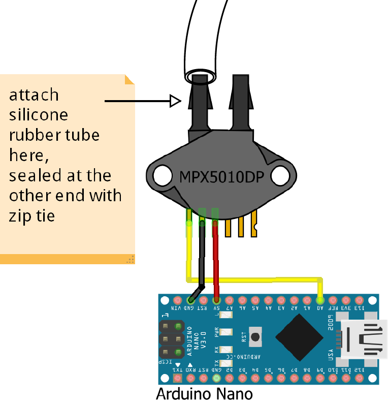

# CycleMassCounter
* counting the number of bicycles during events like critical mass
* big 7-segment led live diplay
* kick-off at cyclehack berlin 2016 http://cyclehackberlin.de/
* inspired by http://www.cyclehack.com/catalogue/happy-counter/

## Hardware
* Arduino
* pressure sensor MPX5010DP http://www.nxp.com/files/sensors/doc/data_sheet/MPX5010.pdf
* silicone rubber tube
* zip tie

## Wiring
  

to be continued ...
